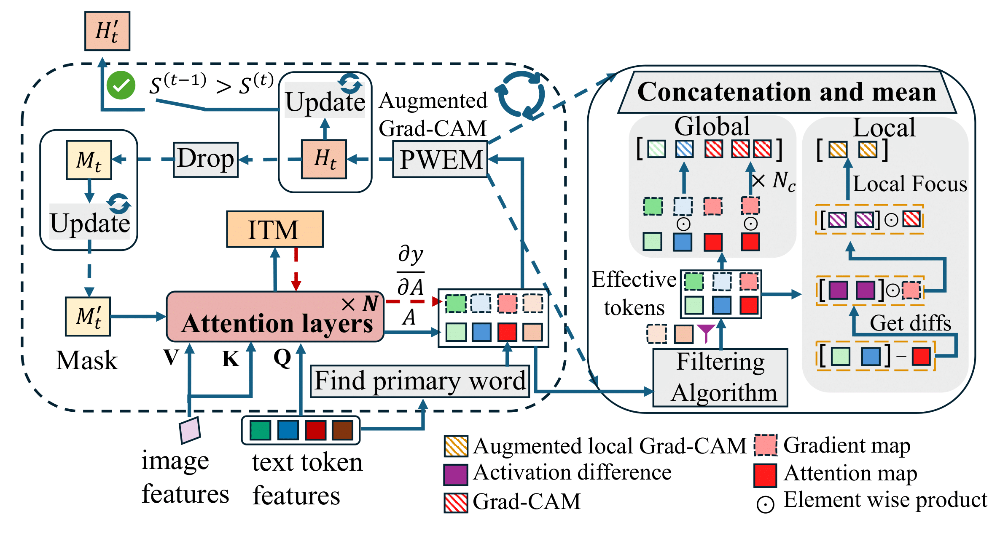
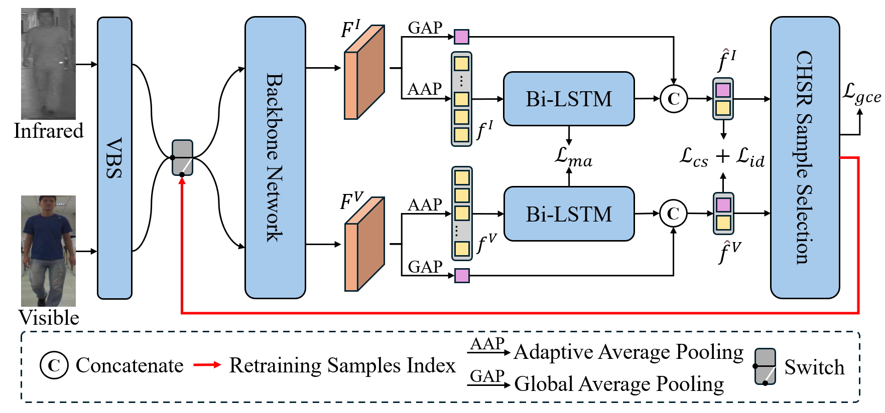

I am a first-year master's student in Computer Technology at Tsinghua University, Shenzhen International Graduate School. I am fortunate to be supervised by Prof. [Chun Yuan](https://www.sigs.tsinghua.edu.cn/yc2/main.psp) in the CVML group. Before that, I obtained my Honors Bachelor’s degree in Computer Science and Technology from the Yingcai Honors College at the University of Electronic Science and Technology of China in 2024.

My research interests span Computer Vision and Multimodal Learning, particularly cross-modal tasks and visual understanding.

---
# ✨ News
---

<!-- * May 2025: One paper on weakly-supervised camouflaged object detection has been submitted to AAAI-2026. -->

<!-- * Mar 2025: Started an algorithm internship at Huawei Noah's Ark Lab, focusing on LLM inference compression. -->

* Mar. 2025: One paper on cross-modal person re-identification was accepted by [ICME-2025](https://2025.ieeeicme.org/) (CCF-B, Oral).
* Dec. 2024: One paper on zero-shot referring image segmentation was accepted by [AAAI-2025](https://aaai.org/conference/aaai/aaai-25/) (CCF-A).

---
# 🔬 Research
---

<table style="width:100%;border:0px;border-spacing:0px;border-collapse:separate;margin-right:auto;margin-left:auto;"><tbody>

<!-- Long2Short -->

<!-- <tr>
<td style="padding:20px;width:30%;max-width:30%" align="center">

</td>
<td width="75%" valign="center">
<papertitle>Large Language Model Inference Compression (Long2Short)</papertitle>
 
Research Project @ <b>Huawei Noah's Ark Lab</b>
 
<em>Algorithm Intern, Mar 2025 - Jul 2025</em>
 

To address the redundancy in Chain-of-Thought (CoT) reasoning, I explored various methods for inference acceleration. I proposed a logits-based loss masking algorithm and an orthogonal reward reconstruction algorithm, which improved inference efficiency and training stability without compromising performance.

</td>
</tr> -->

<!-- FCL-COD -->

<!-- <tr>
<td style="padding:20px;width:30%;max-width:30%" align="center">

</td>
<td width="75%" valign="center">
<papertitle>Weakly-Supervised Camouflaged Object Detection via Frequency-aware and Contrastive Learning</papertitle>
 
<b>Jingchen Ni*</b>, et al.
 
<em>Submitted to AAAI Conference on Artificial Intelligence (<strong>AAAI</strong>)</em>, 2026
 

As the first author, I proposed the FCL-COD framework, which effectively addresses background interference and boundary ambiguity in camouflaged object detection through innovative frequency-aware and gradient-aware contrastive learning mechanisms. The performance surpasses current SOTA models.

</td>
</tr> -->

<!-- IteRPrimE -->

<tr>
<td style="padding:20px;width:30%;max-width:30%" align="center">

</td>
<td width="75%" valign="center">
<!-- <papertitle>IteRPrimE: Zero-shot Referring Image Segmentation with Iterative Grad-CAM Refinement and Primary Word Emphasis</papertitle> -->
<papertitle style="font-family: 'Times New Roman', Times, serif; font-weight: bold; font-size: 1.3em;">IteRPrimE: Zero-shot Referring Image Segmentation with Iterative Grad-CAM Refinement and Primary Word Emphasis</papertitle>
 
Yuji Wang*, <b>Jingchen Ni*</b>, Yong Liu, Chun Yuan, Yansong Tang
 
<em>AAAI Conference on Artificial Intelligence (<strong>AAAI</strong>)</em>, 2025
 
<a href="https://ojs.aaai.org/index.php/AAAI/article/view/32880">[PDF]</a>
<a href="https://github.com/VoyageWang/IteRPrimE">[Project Page]</a>
 

As the project lead and co-first author, I proposed the IteRPrimE method, which significantly improves the localization and semantic relationship processing capabilities for zero-shot referring image segmentation by introducing innovative strategies.

</td>
</tr>

<!-- SAHSR -->

<tr>
<td style="padding:20px;width:30%;max-width:30%" align="center">

</td>
<td width="75%" valign="center">
<papertitle style="font-family: 'Times New Roman', Times, serif; font-weight: bold; font-size: 1.3em;">Semantic Alignment and Hard-Sample Retraining Framework for Cross-Modal Person Re-Identification</papertitle>
 
<b>Jingchen Ni*</b>, Keyu Lyu*, Yu Guo, Chun Yuan
 
<em>IEEE International Conference on Multimedia and Expo (<strong>ICME</strong>)</em>, 2025 (Oral)
 

As the project lead and first author, I proposed the SAHSR framework to address key challenges in Visible-Infrared Person Re-Identification (VI-ReID), including semantic mismatch and hard-sample discrimination. A patent application for the related work is in progress.

</td>
</tr>

</tbody></table>
---
# 🏆 Selected Honors and Awards
--- 

* National Scholarship, 2022
* China "Internet+" College Students' Innovation and Entrepreneurship Competition, National Silver Award, 2022
* IEEEXtreme 16.0 Programming Competition, Global Rank 118/2992, 2022
* Lanqiao Cup National Competition, Third Prize, 2023
* Mathematical Contest in Modeling (MCM), Honorable Mention, 2023
* UESTC Outstanding Student Scholarship, 2021, 2022, 2023
* UESTC Honor's Degree of Bachelor of Engineering, 2024

---
# 👥 Visitors

