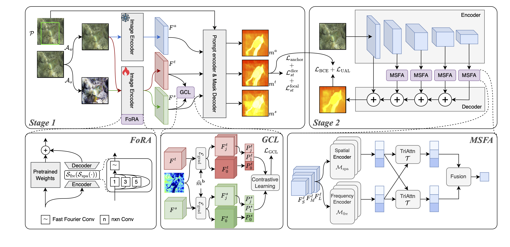
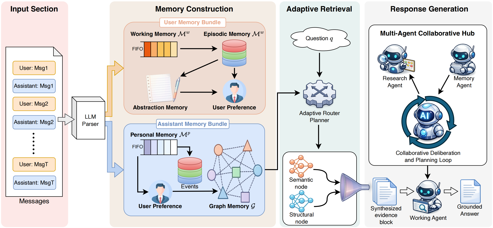
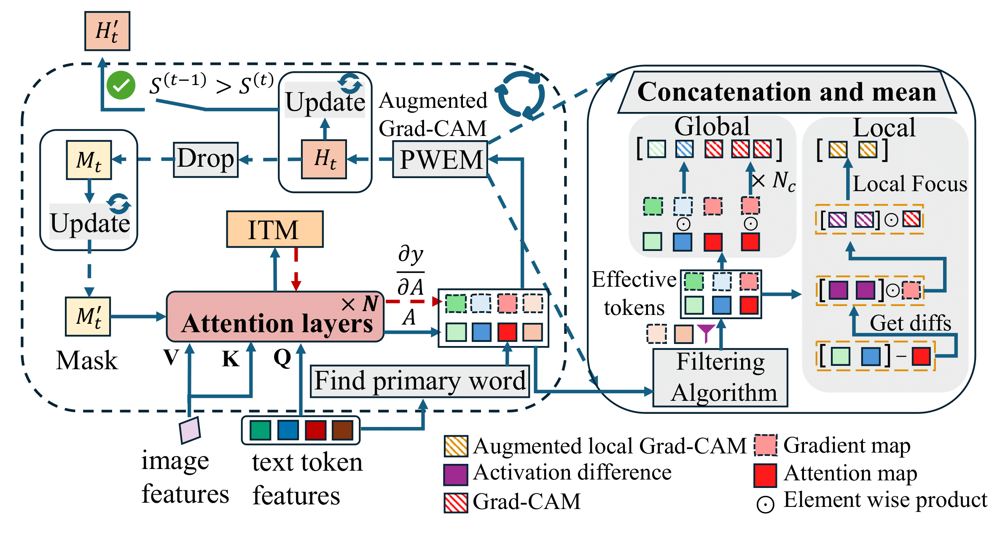
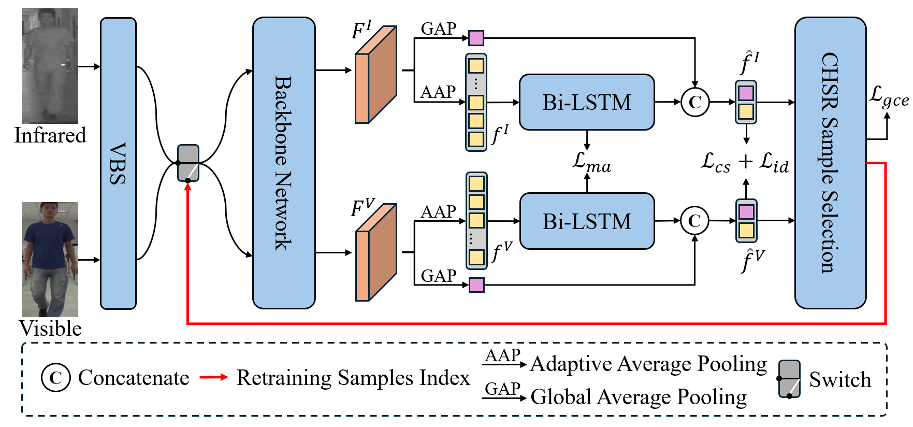

I am a first-year master's student in Computer Technology at Tsinghua University, Shenzhen International Graduate School. I am fortunate to be supervised by Prof. [Chun Yuan](https://www.sigs.tsinghua.edu.cn/yc2/main.psp) in the CVML group. Before that, I obtained my Honors Bachelor’s degree in Computer Science and Technology from the Yingcai Honors College at the University of Electronic Science and Technology of China in 2024.

My research interests include LLM/Agent post-training (SFT/RL), Agent system design, multimodal understanding, and model distillation & self-training.

---
# ✨ News
---

<!-- * May 2025: One paper on weakly-supervised camouflaged object detection has been submitted to AAAI-2026. -->

<!-- * Mar 2025: Started an algorithm internship at Huawei Noah's Ark Lab, focusing on LLM inference compression. -->

* Mar. 2026: One paper on weakly-supervised camouflaged object detection was accepted by [CVPR-2026](https://cvpr.thecvf.com/Conferences/2026) Findings.
* Mar. 2026: One paper on agent systems has been submitted to [ECCV-2026](https://eccv.ecva.net/).
* Mar. 2026: One paper on long-horizon dialogue agents has been submitted to [EMNLP-2026](https://2026.emnlp.org/).
* Mar. 2025: One paper on cross-modal person re-identification was accepted by [ICME-2025](https://2025.ieeeicme.org/) (CCF-B, Oral).
* Dec. 2024: One paper on zero-shot referring image segmentation was accepted by [AAAI-2025](https://aaai.org/conference/aaai/aaai-25/) (CCF-A).

---
# 🔬 Research
---

<table style="width:100%;border:0px;border-spacing:0px;border-collapse:separate;margin-right:auto;margin-left:auto;"><tbody>

<!-- Long2Short -->

<!-- <tr>
<td style="padding:20px;width:30%;max-width:30%" align="center">

</td>
<td width="75%" valign="center">
<papertitle>Large Language Model Inference Compression (Long2Short)</papertitle>
 
Research Project @ <b>Huawei Noah's Ark Lab</b>
 
<em>Algorithm Intern, Mar 2025 - Jul 2025</em>
 

To address the redundancy in Chain-of-Thought (CoT) reasoning, I explored various methods for inference acceleration. I proposed a logits-based loss masking algorithm and an orthogonal reward reconstruction algorithm, which improved inference efficiency and training stability without compromising performance.

</td>
</tr> -->

<!-- FCL-COD -->

<!-- <tr>
<td style="padding:20px;width:30%;max-width:30%" align="center">

</td>
<td width="75%" valign="center">
<papertitle>Weakly-Supervised Camouflaged Object Detection via Frequency-aware and Contrastive Learning</papertitle>
 
<b>Jingchen Ni*</b>, et al.
 
<em>Submitted to AAAI Conference on Artificial Intelligence (<strong>AAAI</strong>)</em>, 2026
 

As the first author, I proposed the FCL-COD framework, which effectively addresses background interference and boundary ambiguity in camouflaged object detection through innovative frequency-aware and gradient-aware contrastive learning mechanisms. The performance surpasses current SOTA models.

</td>
</tr> -->

<!-- FCL-COD -->

<tr>
<td style="padding:20px;width:30%;max-width:30%" align="center">

</td>
<td width="75%" valign="center">
<papertitle style="font-family: 'Times New Roman', Times, serif; font-weight: bold; font-size: 1.3em;">FCL-COD: Weakly Supervised Camouflaged Object Detection with Frequency-aware and Contrastive Learning</papertitle>
 
<b>Jingchen Ni</b>, Quan Zhang, Dan Jiang, Keyu Lv, Ke Zhang, Chun Yuan
 
<em>IEEE/CVF Conference on Computer Vision and Pattern Recognition (<strong>CVPR</strong>)</em>, 2026 (Findings)
 
<a href="https://arxiv.org/pdf/2603.22969">[PDF]</a>
<a href="https://arxiv.org/abs/2603.22969">[arXiv]</a>
 

As the first author, I proposed FCL-COD, a frequency-aware and contrastive learning-based weakly-supervised COD framework. It incorporates Frequency-aware Low-rank Adaptation (FoRA) into SAM to suppress non-camouflage responses, and employs gradient-aware contrastive learning with multi-scale frequency-aware representation learning to achieve precise boundary delineation. The method surpasses both state-of-the-art weakly-supervised and fully-supervised techniques.

</td>
</tr>

<!-- AdaMem -->

<tr>
<td style="padding:20px;width:30%;max-width:30%" align="center">

</td>
<td width="75%" valign="center">
<papertitle style="font-family: 'Times New Roman', Times, serif; font-weight: bold; font-size: 1.3em;">AdaMem: Adaptive User-Centric Memory for Long-Horizon Dialogue Agents</papertitle>
 
Shannan Yan*, <b>Jingchen Ni*</b>, Leqi Zheng, Jiajun Zhang, Peixi Wu, Dacheng Yin, Jing Lyu, Chun Yuan, Fengyun Rao
 
<em>Under review at Conference on Empirical Methods in Natural Language Processing (<strong>EMNLP</strong>)</em>, 2026 (Under Review)
 
<a href="https://arxiv.org/pdf/2603.16496">[PDF]</a>
<a href="https://arxiv.org/abs/2603.16496">[arXiv]</a>
 

We propose AdaMem, an adaptive user-centric memory framework for long-horizon dialogue agents. AdaMem organizes dialogue history into working, episodic, persona, and graph memories, and employs a question-conditioned retrieval route combining semantic retrieval with relation-aware graph expansion. AdaMem achieves state-of-the-art performance on the LoCoMo and PERSONAMEM benchmarks.

</td>
</tr>

<!-- IteRPrimE -->

<tr>
<td style="padding:20px;width:30%;max-width:30%" align="center">

</td>
<td width="75%" valign="center">
<!-- <papertitle>IteRPrimE: Zero-shot Referring Image Segmentation with Iterative Grad-CAM Refinement and Primary Word Emphasis</papertitle> -->
<papertitle style="font-family: 'Times New Roman', Times, serif; font-weight: bold; font-size: 1.3em;">IteRPrimE: Zero-shot Referring Image Segmentation with Iterative Grad-CAM Refinement and Primary Word Emphasis</papertitle>
 
Yuji Wang*, <b>Jingchen Ni*</b>, Yong Liu, Chun Yuan, Yansong Tang
 
<em>AAAI Conference on Artificial Intelligence (<strong>AAAI</strong>)</em>, 2025 (Poster)
 
<a href="https://ojs.aaai.org/index.php/AAAI/article/view/32880">[PDF]</a>
<a href="https://github.com/VoyageWang/IteRPrimE">[Project Page]</a>
 

As the project lead and co-first author, I proposed the IteRPrimE method, which significantly improves the localization and semantic relationship processing capabilities for zero-shot referring image segmentation by introducing innovative strategies.

</td>
</tr>

<!-- SAHSR -->

<tr>
<td style="padding:20px;width:30%;max-width:30%" align="center">

</td>
<td width="75%" valign="center">
<papertitle style="font-family: 'Times New Roman', Times, serif; font-weight: bold; font-size: 1.3em;">Semantic Alignment and Hard-Sample Retraining Framework for Cross-Modal Person Re-Identification</papertitle>
 
<b>Jingchen Ni*</b>, Keyu Lyu*, Yu Guo, Chun Yuan
 
<em>IEEE International Conference on Multimedia and Expo (<strong>ICME</strong>)</em>, 2025 (Oral)
 

As the project lead and first author, I proposed the SAHSR framework to address key challenges in Visible-Infrared Person Re-Identification (VI-ReID), including semantic mismatch and hard-sample discrimination. A patent application for the related work is in progress.

</td>
</tr>

</tbody></table>

---
# 🏗️ Project
--- 
<table style="width:100%;border:0px;border-spacing:0px;border-collapse:separate;margin-right:auto;margin-left:auto;"><tbody>

<!-- Alibaba Research Agent Competition -->
<tr>
  <td style="padding:20px;width:30%;max-width:30%" align="center">
    
  </td>
  <td width="75%" valign="center">
    <papertitle style="font-family: 'SimHei', Times, serif; font-weight: bold; font-size: 1.3em;">阿里云 Data+AI 工程师全球挑战赛 — Research Agent 赛道</papertitle>
     
    🏆 <strong>Rank 4 / 1028 (Top 0.39%)</strong> &nbsp;|&nbsp; <a href="https://tianchi.aliyun.com/specials/promotion/ai2026" target="_blank" rel="noopener">[Competition Page]</a>
     
     
    
Built an end-to-end Research Agent on Alibaba Cloud PAI-LangStudio, deployed as an EAS HTTP service. The agent autonomously plans sub-tasks, invokes web-search and retrieval tools, and synthesizes multi-source evidence to answer complex multi-hop reasoning questions — achieving <strong>4th place out of 1,028 teams</strong> in the final evaluation.

  </td>
</tr>

<!-- ZotLink -->
<tr>
  <td style="padding:20px;width:30%;max-width:30%" align="center">
    
  </td>
  <td width="75%" valign="center">
    <!-- <papertitle>IteRPrimE: Zero-shot Referring Image Segmentation with Iterative Grad-CAM Refinement and Primary Word Emphasis</papertitle> -->
    <papertitle style="font-family: 'SimHei', Times, serif; font-weight: bold; font-size: 1.3em;">ZotLink: MCP Server for Zotero Connector</papertitle>
     

    <!-- 链接 | 实时星标 -->
    <a href="https://github.com/TonybotNi/ZotLink" target="_blank" rel="noopener">[Project Page]</a>
    |
    

     
    
Production-ready MCP server for Zotero to save open preprints (arXiv, CVF, bio/med/chemRxiv) with rich metadata and smart PDF attachments — with upcoming support for publisher databases (Nature, Science, IEEE Xplore, Springer).

  </td>
</tr>

</tbody></table>

---
# 🏆 Selected Honors and Awards
--- 

* National Scholarship, 2022
* China "Internet+" College Students' Innovation and Entrepreneurship Competition, National Silver Award, 2022
* IEEEXtreme 16.0 Programming Competition, Global Rank 118/2992, 2022
* Lanqiao Cup National Competition, Third Prize, 2023
* Mathematical Contest in Modeling (MCM), Honorable Mention, 2023
* UESTC Outstanding Student Scholarship, 2021, 2022, 2023
* UESTC Honor's Degree of Bachelor of Engineering, 2024

---
# 🌍 Visitors

<!-- 

 -->

  

